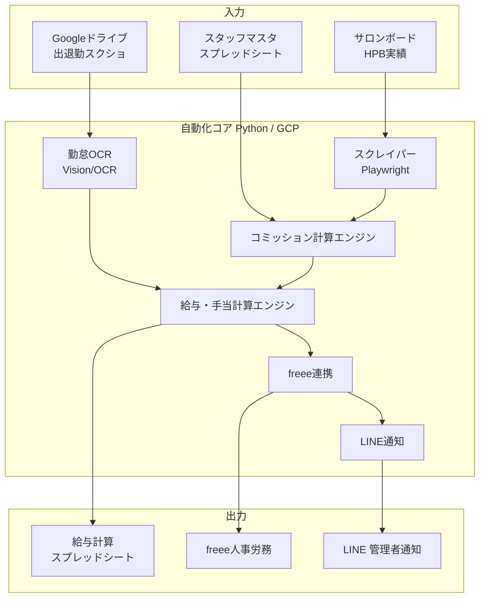

# 美容サロン給与計算 自動化システム 要件定義・設計書

- 作成日: 2026-07-18
- 対象: 美容サロンスタッフの月次給与計算の自動化
- ステータス: ドラフト（v0.1 / 方式決定済み・詳細ヒアリング待ち項目あり）

---

## 1. 目的とゴール

月次の給与計算業務を自動化し、以下を実現する。

1. スタッフの基本情報（雇用形態・基本給・通勤交通費・見做し残業代）を事前登録して再利用する。
2. ホットペッパービューティー（サロンボード）の当月実績（売上・店販・オプション・指名料）を取得し、コミッション計算式に則って各種インセンティブを算出する。
3. タイムカード代わりの「出社・退社スレッドのスクショ」から出退勤時刻・残業時間を算出する。
4. 上記を所定のスプレッドシートに入力し、月給・手当を計算する。
5. 計算結果を freee人事労務 に入力する。
6. 入力完了を LINE で管理者（オーナー）に通知する。

**成功の定義**: オーナーが「実績スクショ／勤怠スクショの配置」と「最終確認・承認」だけを行えば、残りの計算〜freee反映〜通知が自動で完了する状態。

---

## 2. 方式決定サマリ（本セッションでの確定事項）

| 論点 | 決定 | 補足 |
| --- | --- | --- |
| HPB実績の取得方法 | **画面スクレイピングで自動取得** | サロンボードに公開APIが無いため。規約・保守リスクは §9 参照 |
| 出退勤スクショの保管場所 | **Googleドライブ／写真フォルダ** | フォルダ構成の標準化が前提 |
| 実行基盤 | **おまかせ → Python（GCP）を推奨** | 根拠は §4 |
| 今回の進め方 | **まず本設計書を作成** | 実装はフェーズ分割（§8） |

---

## 3. 全体アーキテクチャ

処理は「月次バッチ」として起動（手動キック or スケジュール）。各ステップは冪等（再実行しても二重入力にならない）に設計する。

---

## 4. 実行基盤の選定（おまかせ回答への提案）

### 推奨: Python + Google Cloud

| 要素 | 採用技術 | 理由 |
| --- | --- | --- |
| スクレイピング | **Playwright (Python)** | サロンボードはログイン後のJS描画が多く、Selenium系より安定。ヘッドレス実行可 |
| 勤怠OCR | **Google Cloud Vision API**（日本語対応）or 生成AIのVision | スクショからの時刻抽出精度が高い |
| 計算ロジック | Python（pandas） | 雇用形態別の分岐・コミッション計算を保守しやすい |
| スプレッドシート | **Google Sheets API**（gspread） | 既存スプレッドシートとの読み書き |
| freee連携 | **freee人事労務 API**（OAuth2） | 公式API。従業員・勤怠・支給額の登録 |
| 通知 | **LINE Messaging API**（※後述） | LINE Notify は 2025/3 終了済み |
| 実行/スケジュール | Cloud Run Jobs + Cloud Scheduler、または手元実行 | 月次のため常駐不要。安価に運用可 |
| 秘匿情報 | Secret Manager / .env | 認証情報をコードに置かない |

### GAS（Google Apps Script）を主軸にしない理由
- スクレイピング（Playwright）・OCR・freee OAuth のような重い処理はGAS単体では困難。
- ただし「スプレッドシートUI・簡易トリガー」部分だけGASを併用するハイブリッドは可。

---

## 5. データモデル

### 5.1 スタッフマスタ（事前登録）

| 項目 | 型 | 例 | 備考 |
| --- | --- | --- | --- |
| staff_id | 文字列 | S001 | 一意キー |
| 氏名 | 文字列 | 山田 花子 | |
| 雇用形態 | 区分 | 正社員 / 有期契約社員 / 業務委託 | 計算ロジック分岐に使用 |
| 基本給 | 数値(円) | 250000 | 業務委託は0や別体系もあり得る |
| 通勤交通費 | 数値(円) | 12000 | 非課税上限の扱い要確認 |
| 見做し残業代 | 数値(円) | 30000 | 見做し残業時間数も保持（例:20h） |
| 見做し残業時間 | 数値(h) | 20 | 超過分のみ追加残業代を計算 |
| 各種コミッション率 | 数値(%) | §6参照 | 雇用形態・個人で異なる場合あり |
| freee従業員ID | 文字列 | 12345 | freeeとの突合キー |
| HPB上のスタッフ名 | 文字列 | 花子 | スクレイピング結果との突合キー |

### 5.2 月次実績（HPBスクレイピング結果）

| 項目 | 例 | 備考 |
| --- | --- | --- |
| 対象年月 | 2026-07 | |
| staff_id | S001 | HPB名からマスタで突合 |
| 売上（技術売上） | 800000 | |
| 店販売上 | 50000 | |
| オプション売上 | 30000 | |
| 指名料 | 20000 | 指名件数×単価の場合は件数も |

### 5.3 勤怠（OCR結果）

| 項目 | 例 | 備考 |
| --- | --- | --- |
| staff_id | S001 | |
| 日付 | 2026-07-01 | |
| 出社時刻 | 09:52 | |
| 退社時刻 | 20:15 | |
| 実働時間 | 9.3h | 休憩控除後 |
| 残業時間 | 1.3h | 所定労働時間超過分 |

### 5.4 給与計算結果（出力）

基本給 + 各コミッション + 指名料 + 手当 + 残業代（見做し超過分）− 控除、を雇用形態別ロジックで算出。

---

## 6. コミッション／給与計算式（2026-07-18 実データ反映 / 一部★要確認）

会社: **Mana Lea株式会社**（店舗: SSIN STUDIO / 町田店ほか）。以下は提供資料（新インセンティブ表・雇用契約書）に基づく確定仕様。★印は要確認事項。

### 6.1 売上インセンティブ表（新インセンティブ）

技術売上に応じて、**表のとおり固定額（バック単価）を支給するルックアップ方式**。％では表現できない段差（¥950,000の行）があるため、必ず表の値をそのまま使用する。

| 売上（下限しきい値） | バック単価 | （参考％） |
| --- | --- | --- |
| ¥650,000 | ¥6,500 | 1% |
| ¥700,000 | ¥14,000 | 2% |
| ¥750,000 | ¥22,500 | 3% |
| ¥800,000 | ¥32,000 | 4% |
| ¥850,000 | ¥42,500 | 5% |
| ¥900,000 | ¥54,000 | 6% |
| ¥950,000 | ¥76,000 | 8% |
| ¥1,000,000 | ¥90,000 | 9% |
| ¥1,100,000 以上 | 売上 × 10% | 10% |

適用ロジック（★端数・境界の扱いのみ要確認、下記は暫定仕様）:
- 売上が各しきい値以上・次のしきい値未満なら、その行のバック単価を支給（例: 売上 730,000 → ¥14,000）。
- 売上 **¥650,000 未満は ¥0**（★確認）。
- 売上 **¥1,100,000 以上は 売上 × 10%**（定額でなく率）。
- 「売上」の定義は **総売上（確定）**＝技術売上＋物販＋オプション＋指名料の合計で判定する。
  - なお物販5%・オプション5%・指名料100%は、この売上インセンティブとは**別枠で加算**する（下表）。

### 6.2 その他コミッション・手当

| 項目 | 料率／金額 | 備考 |
| --- | --- | --- |
| 物販（店販）コミッション | 物販売上 × **5%** | 元依頼の「店販」＝「物販」と解釈（★確認） |
| オプション販売コミッション | オプション売上 × **5%** | |
| 指名料 | **100%**（全額を本人へ） | 指名料売上の全額を支給 |
| 店長手当 | **¥20,000** | 対象: **谷本 真澄（確定）** |

> **皆勤/精勤手当（確定）**: 新インセンティブ表の「皆勤手当廃止・統合」の記載にかかわらず、**契約書どおり支給**する。有期契約: 皆勤手当 ¥6,900、正社員: 精勤手当 ¥5,000。支給条件（欠勤時の減額有無）は §6.5 参照。

### 6.3 残業・割増（全雇用形態で共通の割増率）

雇用契約書より、割増賃金率は共通:
- 法定時間外（法定超）: **25%**、月60時間超の部分: **50%**
- 休日（法定休日）: **35%**
- 深夜: **25%**

固定（見做し）残業を超えた分のみ追加支給:
- 追加残業代 = max(0, 実残業時間 − 固定残業時間) × 1時間あたり単価 × 割増率
- 1時間あたり単価の算定基礎（基本給ベースか、手当含むか）は★要確認（一般には基本給等÷月平均所定労働時間）。
- 所定: 10:00〜19:00 の間で **8時間以内**、休憩は労基法どおり（6h超で45分、8h超で60分）、休日はシフトで月7〜9日以上。

### 6.4 雇用形態別サマリ

| 雇用形態 | 例 | 給与月額 | 内訳（基本給／固定残業） | 固定残業時間 | 契約上の手当 |
| --- | --- | --- | --- | --- | --- |
| 正社員（無期） | 谷本 真澄・伊東 真菜 | ¥232,500 | 基本給 ¥217,100 / 固定残業 ¥15,400 | 10時間 | 精勤手当 ¥5,000 |
| 有期契約社員 | 山口 涼風・横井 零奈 | ¥225,600 | 基本給 ¥213,200 / 固定残業 ¥12,400 | 8時間 | 皆勤手当 ¥6,900、土日祝手当 ¥5,000 |
| 業務委託 | （現状該当者なし） | 報酬体系 | 給与ではなく報酬 | 概念なし | 売上ベース中心 |

共通条件: 交通費 上限 ¥30,000、賃金締切 毎月末日、支払 翌月20日、賞与・退職金なし、昇降給あり。研修中の給与は別途（山口: 2026/1、横井: 2025/10 に月給 ¥212,500）。

> ⚠️ 業務委託は労働者ではないため、残業・勤怠・社会保険の考え方が根本的に異なります。現状は該当者がいないため対象外だが、将来追加時は別処理系統が必要。

### 6.5 控除（社保・源泉）の計算 ★本システムで計算（確定）

freee任せにせず**本システムで控除まで計算する**方針。給与計算としては最も重い部分で、以下のマスタ・料率データの整備が前提。

**支給→控除→差引支給の流れ**:
1. 総支給 = 基本給 + 固定残業手当 + 各手当（精勤/皆勤・土日祝・店長） + インセンティブ各種 + 追加残業代
2. 社会保険料控除（健康保険・介護保険・厚生年金）= 標準報酬月額 × 各料率（本人負担分）
3. 雇用保険料控除 = 総支給（対象賃金）× 雇用保険料率（本人負担分）
4. 課税対象額 = 総支給 −（非課税通勤費）−（社保・雇保 本人負担分）
5. 所得税（源泉）= 源泉徴収税額表（月額表・甲/乙欄）を課税対象額＋扶養人数で参照
6. 住民税 = 自治体からの特別徴収通知額（**計算不可・要手入力**）
7. 差引支給額 = 総支給 − 各控除

**控除計算に必要な追加マスタ／データ（要提供）**:
- 健康保険の区分（**協会けんぽ**か健保組合か）と**都道府県**（協会けんぽは県別料率）
- 各人の**標準報酬月額**（社保等級）
- **介護保険**該当（40歳以上）か否か → 生年月日
- **雇用保険**の事業区分（一般の事業 等）
- 源泉: **扶養親族等の数**、甲欄/乙欄区分（扶養控除等申告書の提出有無）
- 住民税: 各人の**特別徴収月額**（自治体通知、毎年6月更新）
- 適用年度の料率テーブル（協会けんぽ料率・厚生年金18.3%・雇用保険料率・源泉徴収税額表）

> ⚠️ 控除計算は年次で料率・税額表が変わるため、**料率テーブルを外部データ化**して毎年更新する設計にする。計算結果は freee の計算値と突合して検証することを推奨。

### 6.6 なお要確認の項目（→ §9 チェックリスト）
- インセンティブ表の境界・端数処理、¥650,000未満=¥0 の可否
- 残業単価の算定基礎（基本給のみか手当含むか、月平均所定労働時間の日数）
- 精勤/皆勤手当の欠勤時減額ルール、土日祝手当 ¥5,000 の支給条件（1日あたり／月額／出勤日数）
- 控除計算に必要な §6.5 の各マスタ（標準報酬月額・都道府県・扶養人数・住民税額 等）

---

## 7. コンポーネント詳細

### 7.1 スタッフマスタ登録
- Googleスプレッドシートの「マスタ」シートを唯一の登録UIとする（オーナーが編集）。
- システムは読み取り専用で参照。突合キーは `HPB上のスタッフ名` と `freee従業員ID`。

### 7.2 HPB実績スクレイパー（Playwright）
- サロンボードにログイン → 対象年月の実績画面へ遷移 → 売上/店販/オプション/指名料を抽出。
- **多要素認証(2FA)/画像認証**がある場合は完全自動化が困難 → 半自動（ログインのみ手動→以降自動）を代替案として用意。
- 取得結果は「実績」シートに書き込み、原本（スクショ/HTML）を証跡として保存。
- 規約リスクは §9。取得頻度は月1回・低頻度に限定。

### 7.3 勤怠OCR
- Googleドライブの `勤怠/YYYY-MM/` フォルダを走査 → 画像をOCR → 出退勤時刻を抽出。
- **前提: スクショの体裁を標準化**（スタッフ名・日時が読み取れる形式）。
- 抽出結果は人が確認できるよう「勤怠」シートに書き出し、低信頼度の項目はフラグ付け。
- 出退勤の対応付け（出社と退社のペアリング）、日跨ぎ、休憩控除ルールを実装。

### 7.4 給与・手当計算エンジン
- マスタ×実績×勤怠を突合し、§6のロジックで算出。
- 雇用形態で分岐。業務委託は別処理系統。
- すべて監査可能なよう、項目ごとの内訳を保持。

### 7.5 スプレッドシート出力
- 「給与計算」シートに1人1行で内訳を出力。オーナーがここで最終確認・承認。

### 7.6 freee人事労務 連携
- 承認済みデータのみ freee API で登録（従業員別の支給額・手当・勤怠）。
- OAuth2トークンは Secret Manager 管理。冪等化（同月二重登録防止）。
- 業務委託の報酬は freee人事労務の給与対象外の可能性 → freee側の適切な機能へ振り分け（要確認）。

### 7.7 LINE通知
- **LINE Notify は 2025/3 終了済み**のため、**LINE Messaging API（Botチャネル）** を使用。
- 管理者のLINEユーザーID宛に「◯月分 給与計算・freee反映 完了。対象◯名、要確認◯件」等をpush通知。
- 代替: LINE公式アカウント作成が難しい場合は、Slack/メール通知も選択肢。

---

## 8. 段階的実装計画（フェーズ）

| フェーズ | 内容 | 成果 |
| --- | --- | --- |
| **F0 準備** | 認証情報整備（サロンボード/freee/LINE/Google）、スプレッドシート雛形、ドライブのフォルダ規約策定 | 動く土台 |
| **F1 計算エンジン** | マスタ＋実績＋勤怠を「手入力データ」で受け、コミッション・給与を計算 | 計算ロジックの確定・検証 |
| **F2 勤怠OCR** | ドライブのスクショ→勤怠データ化 | 勤怠自動化 |
| **F3 HPBスクレイピング** | サロンボードから実績自動取得 | 実績自動化 |
| **F4 freee連携** | 計算結果をfreeeへ登録 | 反映自動化 |
| **F5 通知＋統合** | LINE通知、全体をバッチ化・冪等化・スケジュール | 一気通貫 |

> 計算ロジック（F1）を最初に固めるのが最重要。ここが正しければ、他は「入力の自動化」と「出力の自動化」に分解できる。

---

## 9. リスク・法務・確認事項

### 9.1 リスク・留意点
- **スクレイピングの規約リスク**: サロンボード/ホットペッパーの利用規約でデータの自動取得が禁止されている可能性があります。実装前に規約確認を推奨。低頻度・自アカウント・自店データに限定して運用する前提でも、規約違反となればアカウント停止等のリスクがあるため、CSVエクスポート方式への切替も常に代替として保持します。
- **2FA/CAPTCHA**: ログインに多要素認証があると全自動化は困難。半自動フォールバックを用意。
- **個人情報・給与情報の管理**: 認証情報・給与データの保管は最小権限・暗号化・アクセス制御を徹底。
- **労務コンプライアンス**: 残業割増・最低賃金・業務委託の労働者性など、計算ロジックは社労士確認を推奨。
- **業務委託の扱い**: 給与ではなく報酬。税・保険・freeeでの処理が根本的に異なる。

### 9.2 ヒアリング確認チェックリスト（次アクション）
- [ ] コミッション各料率・段階・端数処理の正確な定義
- [ ] 指名料の算定方法
- [ ] 所定労働時間・休憩・残業割増率・深夜/休日の扱い
- [ ] 手当の種類と金額・支給条件
- [ ] 通勤費の課税/非課税
- [ ] 控除（社保・源泉）は本システム計算 or freee任せか
- [ ] サロンボードのログイン方式（2FA有無）と実績画面の項目名
- [ ] freee人事労務のプラン・API利用可否・業務委託報酬の処理方法
- [ ] LINE公式アカウント（Messaging API）の準備可否
- [ ] 勤怠スクショの体裁（1枚に何が写るか）とドライブのフォルダ命名規約
- [ ] 既存の「所定のスプレッドシート」の実物（列構成）

---

## 10. 次アクション

1. §9.2 のヒアリング項目を埋める（特にコミッション計算式）。
2. フェーズ **F1（計算エンジン）** から着手。まず手入力データで計算を再現し、実際の給与明細と突合して正しさを検証。
3. 検証が取れたら、入力側（F2 OCR / F3 スクレイピング）と出力側（F4 freee / F5 通知）を順次自動化。
